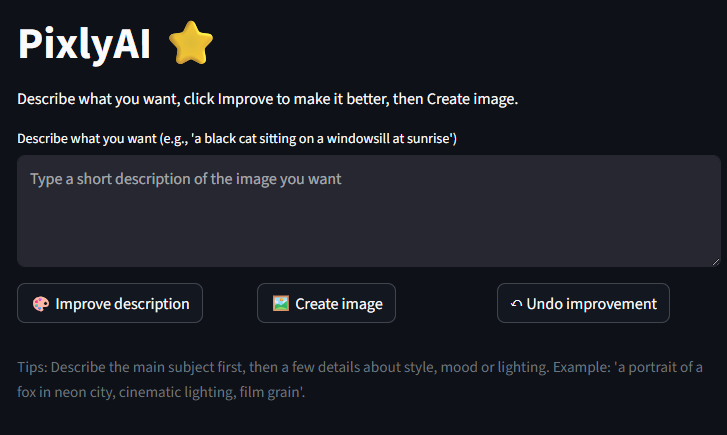

# PixlyAI ⭐

A small, friendly Streamlit app that helps you turn short text descriptions into beautiful images. PixlyAI improves your description (automatically enriches with photographic/style details) and sends it to an image generation endpoint — all from a clean, simple UI.

---

✨ Key features
- Simple, user-friendly interface: type a short description, press "Improve description", then "Create image".
- Local enhancement engine: a built-in enhancer appends rich, varied descriptors so you get unique, detailed prompts every time.
- Undo support: revert the last improvement if you don't like it.
- Image download + regenerate: save the generated image or create another variant from the same prompt.
- Small, dependency-focused codebase: easy to run and modify.

---

📸 Screenshot


---

🚀 Quick start

1. Clone the repo and change into the project directory:
   ```bash
   git clone https://github.com/yourname/pixlyai.git
   cd pixlyai
   ```

2. Create and activate a virtual environment (recommended):
   - macOS / Linux:
     ```bash
     python -m venv .venv
     source .venv/bin/activate
     ```
   - Windows (PowerShell):
     ```powershell
     python -m venv .venv
     .\.venv\Scripts\Activate.ps1
     ```

3. Install dependencies:
   ```bash
   pip install -r requirements.txt
   ```

4. Run PixlyAI:
   ```bash
   streamlit run app/streamlit_app.py
   ```

5. Open the browser at the local URL Streamlit prints (usually `http://localhost:8501`).

---

⚙️ Configuration

- Override the Pollinations endpoint (if you use a proxy or alternative image service) by creating a `.env` in the project root with:
  ```
  POLLINATIONS_BASE_URL=https://image.pollinations.ai/prompt/
  ```
- No external API keys are required by default. The app uses the local fallback enhancer for prompt improvements.

---

🧩 How it works (brief)
- User types a short description (e.g., "a black cat").
- Click "Improve description" — the enhancer appends 4–7 varied descriptors (lighting, lens, texture, mood).
- The improved description replaces the main input (so the user always sees what will be used).
- Click "Create image" — the improved text is sent to Pollinations (or your configured endpoint) and the resulting image is shown and can be downloaded.

---

🛠️ Tips for better images
- Put the main subject first: "a cyclist", "a fox", "a rustic cottage".
- Add style/lighting keywords: "cinematic lighting", "golden hour", "moody film grain".
- Try different levels of detail and regenerate to explore variations.

---

🧹 Clean & minimal code
This repo is intentionally small and focused:
- app/streamlit_app.py — UI and app flow
- app/services/enhancer.py — the local prompt enhancer (primary)
- app/services/pollinations.py — image fetcher
- app/utils/downloader.py — prepare download bytes
- app/utils/session_helpers.py — simple session-state helpers
- requirements.txt, .env.example, README.md

Remove any old debug files if present (e.g., backup copies or debug helpers) — they are not necessary.

---

📣 Troubleshooting
- If the UI looks unchanged after editing, stop Streamlit and re-run it from the project root:
  ```bash
  streamlit run app/streamlit_app.py
  ```
  Then hard-refresh the browser (Ctrl/Cmd+Shift+R).
- If an image fails to generate, check the terminal for the HTTP error and ensure your network allows outgoing requests to the configured endpoint.

---

🤝 Contributing
Small, focused contributions welcome:
- Improve enhancer descriptors or weights
- Add tests for the enhancer logic
- Add a settings panel to control the number of appended descriptors or enable/disable certain styles

Please open an issue or a PR with a short description of your change.

---

📄 License
MIT — feel free to reuse and modify the code. Include attribution if you republish.


